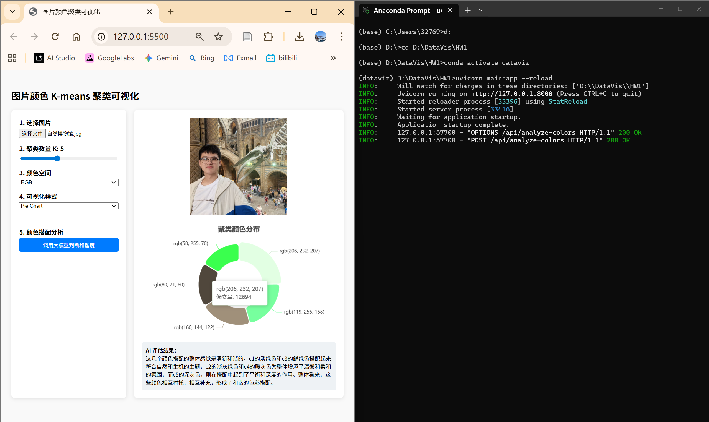

# DataVis_HW——图片颜色聚类可视化
## 王业涵 &nbsp;10245102458  

###  一、项目简介  
本项目是一个基于 Web 的图片颜色分析工具，能够自动提取图片中的主要色彩，并通过 API 调用 LLM，使其对颜色搭配的和谐度进行评价。

当前推荐使用 **Streamlit 部署版**，可一键部署到 Streamlit Community Cloud；仓库中同时保留了早期的 FastAPI + HTML **本地运行版**，见 `legacy/`。

---

### 二、技术栈
- **主应用 (Streamlit)**: Python 3.10+, Streamlit, Plotly, NumPy, Pillow
- **算法**: K-means 聚类（支持 RGB / LAB）
- **LLM**: GPT-3.5-Turbo（支持 OpenAI 官方接口与 openai-proxy.org 代理，可切换）
- **本地旧版**: HTML / CSS / JavaScript, Apache ECharts, FastAPI

---

### 三、项目结构  
```
DataVis_HW
    ├── app.py                 # Streamlit 主入口（推荐）
    ├── assets/
    │   └── Windy_Hill.mp3     # 侧边栏背景音乐
    ├── .streamlit/
    │   └── config.toml        # 页面主题配置
    ├── legacy/                # 本地运行版（FastAPI + HTML）
    │   ├── index.html
    │   └── main.py
    ├── .env.example
    ├── requirements.txt
    ├── README.md
    └── Screenshots/
```  

---

### 四、核心功能
1. **基础要求实现**
   - 颜色聚类: 实现 K-means 聚类算法，支持 $K \geq 5$；
   - 多维可视化: 使用 Plotly 展示聚类中心的 RGB 均值及像素数量；
   - 图表展示: 支持饼图与柱状图的动态渲染。

2. **进阶要求实现**
   - 动态交互: 支持用户自定义上传图片、实时调节 $K (2 \le K \le 10)$ 值；
   - 多空间转换: 支持在 RGB 与 LAB 颜色空间下执行聚类；
   - API Key 网页填写: 侧边栏密码框输入密钥，仅保存在当前会话，无需手动编辑 `.env`；
   - 双接口切换: 可在 `api.openai.com` 与 `openai-proxy.org` 之间切换；
   - AI 智能评估: 结合 LLM 对提取的颜色组合进行审美分析，并给出具体的色彩改进建议；
   - 背景音乐: 侧边栏内置 `Windy_Hill.mp3` 播放器，支持自动播放与手动暂停，提升交互氛围；
   - 在线部署: 可直接部署到 Streamlit Community Cloud。

---

### 五、算法思想
1. **降采样处理**: 对原始像素数据进行步长采样，在不影响聚类精度的前提下提升计算速度。
2. **K-means 迭代**: 
   - 随机初始化 $K$ 个质心；
   - 迭代计算每个像素点到质心的欧氏距离；
   - 更新质心为簇内颜色的均值。
3. **空间转换**: 
   - RGB 转 LAB：通过 XYZ 中间空间进行 D65 标准转换；
   - LAB 转 RGB：将聚类中心还原为可显示的色彩值。  

---

### 六、快速复现
1. **安装依赖**
   ```bash
   pip install -r requirements.txt
   ```
2. **启动应用**
   ```bash
   streamlit run app.py
   ```
   浏览器会打开本地页面（默认 [http://localhost:8501](http://localhost:8501)）。
3. **填写密钥**
   - 在左侧「API 设置」中粘贴 OpenAI API Key，并选择接口来源；
   - （可选）也可在 `.env` 中配置 `OPENAI_API_KEY`，或在 Streamlit Secrets 中写入同名密钥，作为未填写时的回退。

4. **部署到 Streamlit Cloud**
   - 将本仓库推送到 GitHub；
   - 打开 [share.streamlit.io](https://share.streamlit.io)，选择仓库与分支；
   - Main file path 填写 `app.py`；
   - （可选）在 App settings → Secrets 中添加：
     ```toml
     OPENAI_API_KEY = "sk-..."
     ```
   - 即使用户未在 Secrets 中配置，也可在网页侧边栏自行填写密钥后使用 AI 分析。

---

### 七、本地运行版
适合希望体验前后端分离架构的开发者。

1. **后端启动**
   - 在项目根目录安装依赖: `pip install -r requirements.txt`；
   - 配置密钥: 复制 `.env.example` 为 `.env`，填入 `OPENAI_API_KEY`；
   - 运行服务:
     ```bash
     uvicorn legacy.main:app --reload
     ```
     默认运行在 [http://127.0.0.1:8000](http://127.0.0.1:8000)。

2. **前端运行**
   - 使用 VS Code 的 Live Server 插件打开 `legacy/index.html`；
   - 确保前端访问地址为 [http://127.0.0.1:5500](http://127.0.0.1:5500)。

---  
### 八、作品截图
<div align="center">
    
    <br>
    <em>图1：ECharts 可视化结果与 Anaconda 终端日志（聚类数：5，颜色空间：RGB，可视化样式：Pie Chart）</em>
</div>  
<br>
<div align="center">
    
    <br>
    <em>图2：ECharts 可视化结果全屏展示（聚类数：7，颜色空间：LAB，可视化样式：Bar Chart）</em>
</div>
